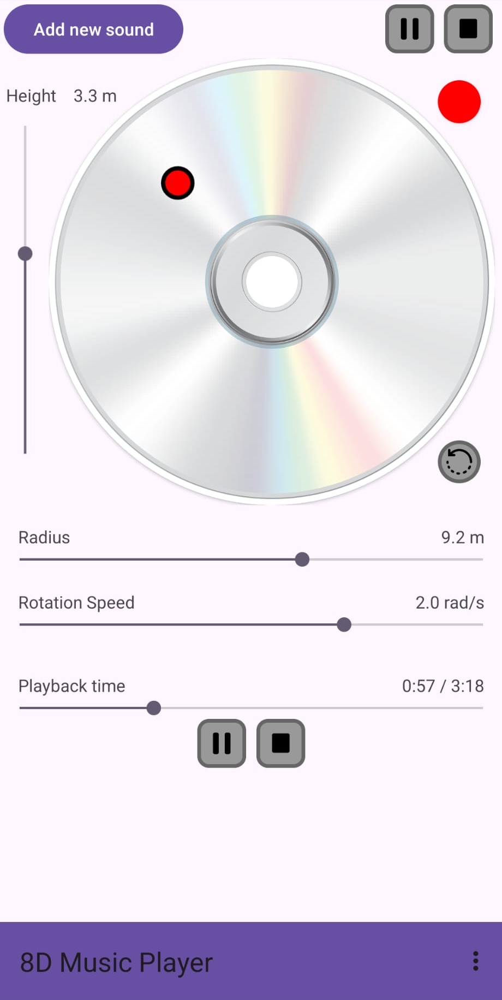

# 8DMusicPlayer
Android music player that supports 3D/8D spatial sound.

## Introduction
Application designed for the purpose of being able to play any music track on Android with spatial sound
effects.

It is optimized to not be resource heavy so it doesn't drain battery quickly, and
it behaves like any normal music player (keeps playing in the background, stops when closed).

You will notice it lacks some popular features among music players, like the ability to display
songs by album or artist, or playlist support. I will bother implementing those functionalities
if requested, or if the application gets somewhat popular. For now, I myself prefer looking at my
music tracks through folder navigation.

You will also notice it can't queue multiple songs (when the current one stops, no more songs play).
That is intended, since the application supports multiple tracks to be played at once. This can be useful
if you want to play a track split by instruments (for example), and have each instrument be in a different
position to create a more immersive 3D experience.

## Installation
To install the latest release, go to the [releases](https://github.com/PauHPMCBR/8DMusicPlayer/releases/tag/v1.0)
page and download the apk, and install it on your mobile device (you will probably be warned it is not safe or something,
if you don't trust the application you can always scan it first in [virustotal](https://www.virustotal.com)).

## How to use the app
Inside the application, there is a screen that displays the following help document:
[help.md](app/src/main/assets/help.md)

There are some settings it's important to be aware of, which are:
- HRTF: a "Head Related Transfer Function" is a function that converts mono audio to "3D" audio. There are multiple algorithms implemented to do this conversion, and a lot of options are given to select whichever works best with a particular ear's shape.
- Reverb: Since OpenAL (library used to play music) offers some reverb options, I included them in the application. You can try see if you like any, or just leave it off.

## Technicalities
This application is coded with Java for "frontend"(?) and C++ for managing audio playback with OpenAL.
Hopefully I didn't do anything completely wrong while doing it, it was my first time using Java and C++
in the same project, and on top of that, an *Android* project...

The Java part takes care of all displays, implementing interaction with the user and sending information
to the C++ part. The C++ part just plays the music files that receives the way its told.

All code is original except for the file chooser (or file explorer), which is taken from 
[this project from imranhasanhira](https://github.com/imranhasanhira/android-file-chooser).

Inside [this other README](app/src/main/jni/README.md) you will find more detailed information on
dependencies and how to set up.

Compiling OpenAL for Android was a nightmare (that's why I only have support for ARM 64 bits (v8a) architectures),
specially since I had to do all that cmake stuff from Windows.
If you are having trouble doing it, I recommend looking at the GitHub link there is on the other README
linked above and, if you still can't manage doing it, I guess I can try helping with the experience I now have...?

## Contact
I prefer through Discord (my name there is @paumb, just DM me),
but I will probably see if any GitHub issue gets open.